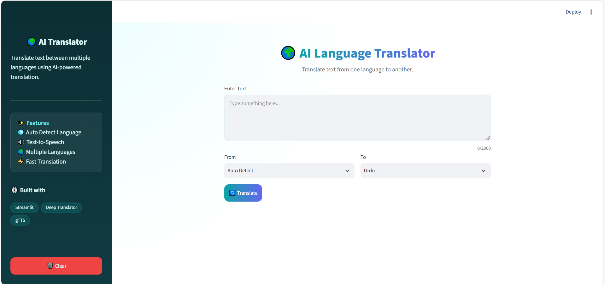
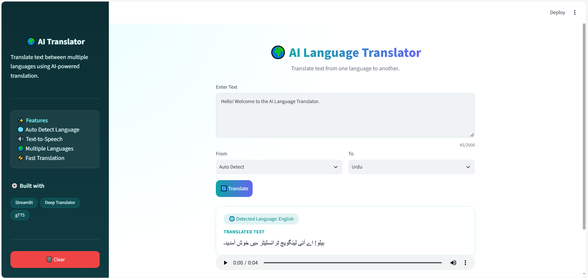
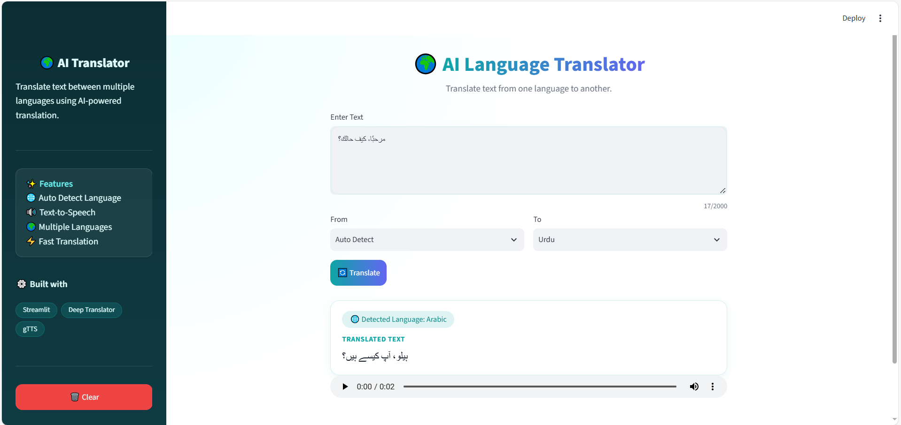
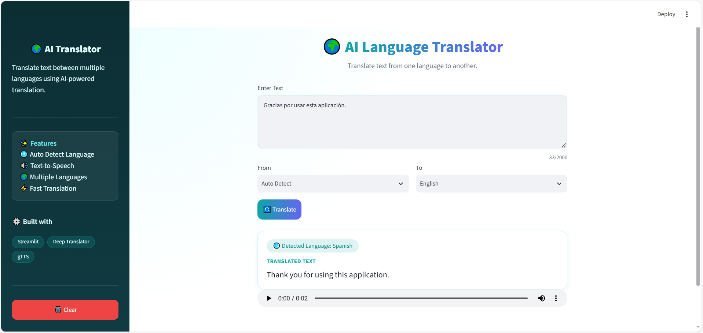

# 🌍 AI Language Translator

An AI-powered Language Translator built with **Python** and **Streamlit**. The application translates text between multiple languages using **Deep Translator** and provides **Text-to-Speech (TTS)** functionality using **gTTS**.

---

## 🚀 Features

- 🌐 Automatic source language detection
- 🌍 Translate text into multiple languages
- 🔊 Text-to-Speech (TTS) for translated text
- ⚡ Fast and accurate translation
- 🎨 Clean and user-friendly Streamlit interface

---

## 🛠️ Technologies Used

- Python
- Streamlit
- Deep Translator
- gTTS

---

## ⚙️ Installation

### Clone the repository

```bash
git clone https://github.com/AbihaNadeem005/CodeAlpha_Language_Translation_Tool.git
```

### Navigate to the project

```bash
cd CodeAlpha_Language_Translation_Tool
```

### Install dependencies

```bash
pip install -r requirements.txt
```

### Run the application

```bash
streamlit run app.py
```

---

## 💡 How It Works

1. Enter the text you want to translate.
2. Choose the source language or use **Auto Detect**.
3. Select the target language.
4. Click **Translate**.
5. Listen to the translated text using the built-in Text-to-Speech feature.

---

## 📸 Demo

### 🏠 Home Screen



### 🌍 English → Urdu



### 🇩🇪 German → English


### 🇸🇦 Arabic → Urdu



### 🇪🇸 Spanish → English



---

## 🎥 Demo

A short demonstration of the Language Translator is available below.

▶️ **[Watch Demo Video](https://drive.google.com/file/d/1xfWtoazBkoNfOC5fMfxjMEtgGA_rfL5k/view?usp=sharing)**